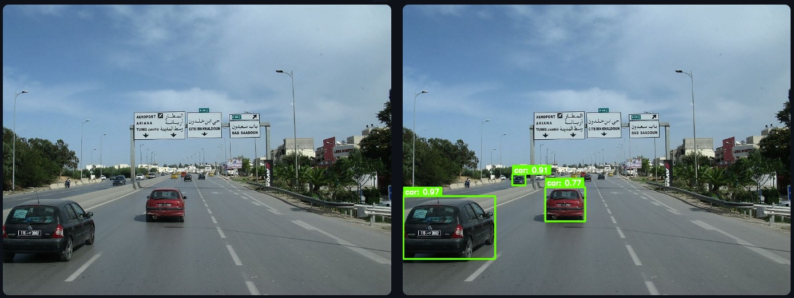
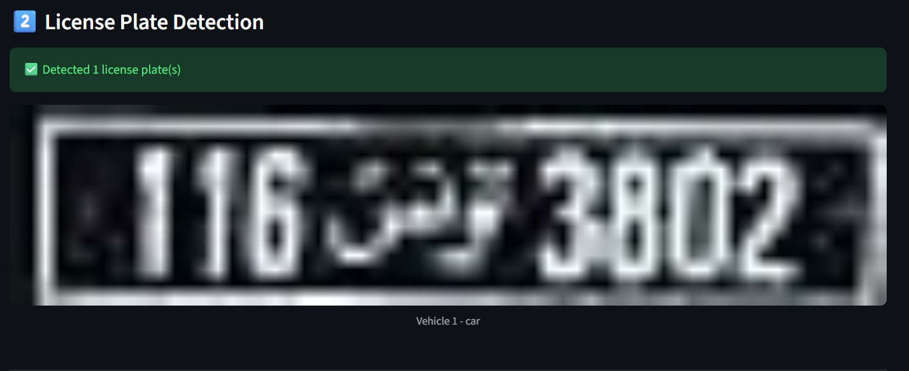
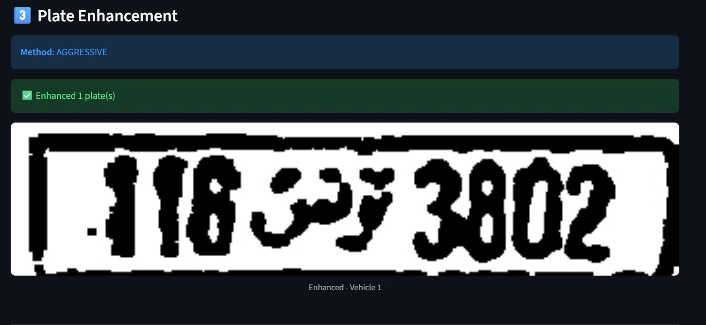
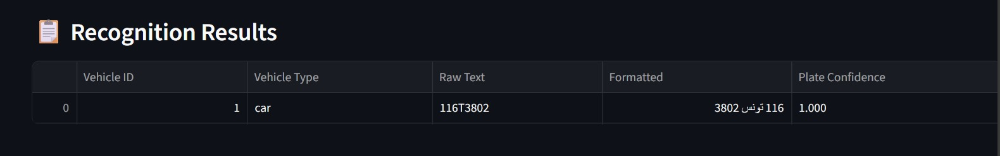

# AutoPlateTN - Automatic Tunisian License Plate Recognition System

[](https://www.python.org/downloads/)
[](https://pytorch.org/)
[](LICENSE)
[](https://streamlit.io/)

An end-to-end deep learning pipeline for detecting and recognizing Tunisian license plates in images. Built with state-of-the-art object detection and OCR models, featuring an interactive web interface.

[Demo](#demo) • [Features](#features) • [Quick Start](#quick-start) • [Results](#results) • [Usage](#usage)

---

## Demo

### Complete Pipeline Visualization

#### 1️ Vehicle Detection

*Cascade R-CNN detects all vehicles in the image with bounding boxes*

#### 2️ License Plate Detection

*Faster R-CNN localizes license plates on detected vehicles*

#### 3️ Plate Enhancement

*Advanced image preprocessing: denoising, upscaling (4x-6x), CLAHE, binarization*

#### 4️ Final OCR Results

*CRNN model reads characters and formats plates in Tunisian standard (Arabic + digits)*

---

##  Features

###  **Multi-Stage Detection Pipeline**
- **Stage 1**: Vehicle Detection using Cascade R-CNN
- **Stage 2**: License Plate Detection using Faster R-CNN
- **Stage 3**: Adaptive Image Enhancement (4 methods)
- **Stage 4**: OCR Recognition using CRNN with CTC Loss

###  **Advanced Image Processing**
- **4 Enhancement Methods**: Original, Light, Full (recommended), Aggressive
- **Techniques**: 
  - Denoising (fastNlMeans)
  - Super-resolution upscaling (4x-6x)
  - Contrast enhancement (CLAHE)
  - Gamma correction
  - Bilateral filtering
  - Adaptive binarization
  - Morphological operations

###  **Interactive Web Interface**
- Built with **Streamlit** for easy deployment
- Real-time processing with live visualization
- Adjustable confidence thresholds
- Multiple enhancement method selection
- Downloadable results

###  **Tunisian Plate Support**
- Recognizes both standard and private plates
- Automatic formatting with Arabic text (تونس / نت)
- Proper number grouping and centering
- Format: `XXX تونس XXXX` or `XXXXXX نت`
---
##  Quick Start

### Prerequisites

- Python 3.8+
- CUDA-capable GPU (optional, for faster processing)
- Git

### Installation

1. **Clone the repository**
```bash
git clone https://github.com/Malek-logh/AutoPlateTN.git
cd AutoPlateTN
```

2. **Clone Detectron2** (no pip install needed)
```bash
git clone https://github.com/facebookresearch/detectron2.git
```

3. **Create virtual environment**
```bash
python -m venv venv
source venv/bin/activate  # On Windows: venv\Scripts\activate
```

4. **Install dependencies**
```bash
pip install torch torchvision torchaudio --index-url https://download.pytorch.org/whl/cu118
pip install opencv-python numpy pandas streamlit pillow tqdm
pip install fvcore
```

5. **Download pre-trained models**
   - Place your trained models in `models/detection/` and `models/ocr/`
   - Required files:
     - `cascade_best.pth` (vehicle detection)
     - `fasterrcnn_tunisia_plates.pth` (plate detection)
     - `best_crnn_model.pth` (OCR)
     - Optional: `best_crnn_light.pth`, `best_crnn_full.pth`, `best_crnn_aggressive.pth`

###  Run the Application

#### Option 1: Streamlit Web Interface (Recommended)
```bash
streamlit run app.py
```
Then open your browser at `http://localhost:8501`

#### Option 2: Command Line Pipeline
```bash
# Step 1: Detect vehicles
python vehicle_detection_inference.py

# Step 2: Detect plates
python platedetectortest.py

# Step 3: Enhance plates
python src/preprocessing/image_enhancing.py

# Step 4: Run OCR
python test_crnn_model.py
```
##  Usage

### Web Interface

1. Launch the app: `streamlit run app.py`
2. Upload an image containing vehicles
3. Adjust confidence thresholds if needed
4. Select enhancement method (Full recommended)
5. Click "Start Processing"
6. View results with formatted plate numbers
   
---

## Model Training (Optional)

If you want to train your own models:

### 1. Vehicle Detection
- Dataset: https://universe.roboflow.com/rjacaac1/ua-detrac-dataset-10k/dataset/2
- Framework: Detectron2
- Architecture: Cascade Mask R-CNN (R-50-FPN)
- Classes: 4 

### 2. Plate Detection
- Dataset: https://datasetninja.com/tunisian-licensed-plates
- Framework: PyTorch + torchvision
- Architecture: Faster R-CNN (ResNet-50-FPN)
- Classes: 2 (background + license plate)

### 3. OCR Model
- Dataset: https://zindi.africa/competitions/ai-hack-tunisia-2-computer-vision-challenge-2/data
- Framework: PyTorch
- Architecture: CRNN (CNN + BiLSTM)
- Loss: CTC (Connectionist Temporal Classification)
- Characters: `0123456789TN` (digits + Tunisia marker)


**Star this repository if you find it helpful!**
</div>
